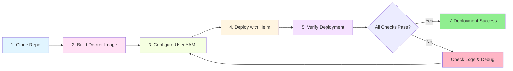

# Deployment Guide

Complete deployment instructions for the Online Platform Automation framework.

## Prerequisites

- **Docker**: v20.x or later
- **Kubernetes**: v1.24+ (Minikube, Docker Desktop, k3s, or cloud)
- **Helm**: v3.x or later
- **Node.js**: v18.0.0+ (for local development)
- **kubectl**: Configured for your cluster

## Deployment Workflow



## Step-by-Step Deployment

### 1. Clone and Setup

```bash
git clone <your-repo-url>
cd online-platform-automation
```

### 2. Build Docker Image

```bash
npm run docker:build
# Or manually:
docker build -t online-platform-automation:dev source
```

### 3. Configure User

Create or edit `user-configs/user1.yaml`:

```yaml
userConfig:
  username: "your_username"
  password: "your_password"
  homeUrl: "https://platform.example.com"
  emailPrefix: "you@example.com"
  targetUrl: "https://platform.example.com/target"
  logLevel: "info"
  headless: 1
```

### 4. Deploy to Kubernetes

```bash
helm install user1 helm/platform-automation -f user-configs/user1.yaml
```

### 5. Verify Deployment

```bash
kubectl get pods
kubectl logs -f -l app=user1
```

## Deployment Scenarios

### Single User Deployment

```bash
helm install user1 helm/platform-automation -f user-configs/user1.yaml
```

### Multiple User Deployment

```bash
helm install user1 helm/platform-automation -f user-configs/user1.yaml
helm install user2 helm/platform-automation -f user-configs/user2.yaml
helm install user3 helm/platform-automation -f user-configs/user3.yaml
```

### Update Existing Deployment

```bash
helm upgrade user1 helm/platform-automation -f user-configs/user1.yaml
```

### Remove Deployment

```bash
helm uninstall user1
```

## Configuration

### Helm Values (values.yaml)

```yaml
replicaCount: 1

image:
  repository: online-platform-automation
  pullPolicy: IfNotPresent
  tag: "dev"

userConfig:
  username: ""
  password: ""
  homeUrl: ""
  emailPrefix: ""
  targetUrl: ""
  logLevel: "info"
  headless: 1

resources:
  limits:
    cpu: 500m
    memory: 512Mi
  requests:
    cpu: 100m
    memory: 256Mi
```

### Environment Variables

- `USERNAME`: Platform username
- `PASSWORD`: Platform password
- `HOME_URL`: Platform base URL
- `EMAIL_PREFIX`: Email configuration
- `TARGET_URL`: Target resource/session URL
- `LOG_LEVEL`: Logging level (`debug`, `info`, `warn`, `error`)
- `HEADLESS`: Browser mode (1 = headless, 0 = visible)
- `PORT`: Server port (default: 3000)

## Common Commands

### Docker Commands

```bash
# Build image
npm run docker:build

# Remove image
docker image rm online-platform-automation:dev

# Full rebuild and deploy
npm run auto

# List images
docker images | grep online-platform-automation
```

### Helm Commands

```bash
# Install
helm install <name> helm/platform-automation -f user-configs/<user>.yaml

# Upgrade
helm upgrade <name> helm/platform-automation -f user-configs/<user>.yaml

# Uninstall
helm uninstall <name>

# List deployments
helm list

# Get values
helm get values <name>

# Dry-run (validate before deploy)
helm install <name> helm/platform-automation -f user-configs/<user>.yaml --dry-run --debug

# Lint chart
helm lint helm/platform-automation

# Preview rendered templates
helm template test helm/platform-automation -f user-configs/user1.yaml
```

### Kubernetes Commands

```bash
# View pods
kubectl get pods

# View logs (follow)
kubectl logs -l app=<release-name> -f

# View logs (last 100 lines)
kubectl logs --tail=100 deployment/<release-name>

# Describe pod
kubectl describe pod <pod-name>

# Execute into container
kubectl exec -it <pod-name> -- sh

# Delete pod (will be recreated)
kubectl delete pod <pod-name>

# Scale deployment
kubectl scale deployment <release-name> --replicas=2

# View resource usage
kubectl top pods
kubectl top nodes
```

## Troubleshooting

### Pod Not Starting

```bash
kubectl describe pod <pod-name>
kubectl logs <pod-name>
```

**Common causes:**
- Image not found: Rebuild image or check image name
- ImagePullBackOff: Set `pullPolicy: IfNotPresent` or `Never`
- CrashLoopBackOff: Check application logs

### Image Pull Errors

For local images with Minikube:
```bash
minikube image load online-platform-automation:dev
```

For Docker Desktop: Ensure image exists
```bash
docker images | grep online-platform-automation
```

### Configuration Issues

```bash
# Validate Helm chart
helm lint helm/platform-automation

# Preview rendered templates
helm template test helm/platform-automation -f user-configs/user1.yaml
```

### Resource Constraints

If pods are evicted or OOMKilled, adjust resource limits:

```yaml
resources:
  limits:
    cpu: 1000m
    memory: 1Gi
  requests:
    cpu: 200m
    memory: 512Mi
```

### View Resource Usage

```bash
kubectl top pods
kubectl top nodes
```

## Managing Multiple Users

### Batch Deployment Script

Create `deploy-all.sh`:

```bash
#!/bin/bash
for config in user-configs/*.yaml; do
  username=$(basename "$config" .yaml)
  echo "Deploying $username..."
  helm install "$username" helm/platform-automation -f "$config"
done
```

Run:
```bash
chmod +x deploy-all.sh
./deploy-all.sh
```

### List All Instances

```bash
helm list
kubectl get pods -o wide
```

### Batch Uninstall

```bash
#!/bin/bash
for release in $(helm list -q); do
  echo "Uninstalling $release..."
  helm uninstall "$release"
done
```

## Local Development

### Development Setup

```bash
cd source
npm install
npm run dev          # Run with ts-node
npm run build        # Compile TypeScript
npm start            # Run compiled JS
```

### Environment Variables

Create `source/.env` for local development:

```bash
USERNAME=your_username
PASSWORD=your_password
HOME_URL=https://platform.example.com
EMAIL_PREFIX=you@example.com
TARGET_URL=https://platform.example.com/target
LOG_LEVEL=debug
HEADLESS=1
PORT=3000
```

**⚠️ Never commit `.env` files!**

## Security Best Practices

- Never commit `.env` files or secrets to version control
- Use Kubernetes Secrets for sensitive data in production
- Set resource limits to prevent resource exhaustion
- Use network policies for pod isolation
- Implement RBAC for namespace-scoped access
- Regularly update dependencies for security patches

## Advanced Topics

### Blue-Green Deployment

```bash
# Deploy new version with different release name
helm install user1-v2 helm/platform-automation -f user-configs/user1.yaml

# Test new version
kubectl logs -l app=user1-v2 -f

# Switch traffic (update service selector)
# Delete old version
helm uninstall user1
```

### Using Kubernetes Secrets

```bash
# Create secret
kubectl create secret generic user1-creds \
  --from-literal=username=user1 \
  --from-literal=password=secretpass

# Reference in values.yaml
userConfig:
  usernameSecret: user1-creds
  passwordSecret: user1-creds
```

### Resource Monitoring

```bash
# Install metrics-server (if not available)
kubectl apply -f https://github.com/kubernetes-sigs/metrics-server/releases/latest/download/components.yaml

# View resource usage
kubectl top pods
kubectl top nodes
```
