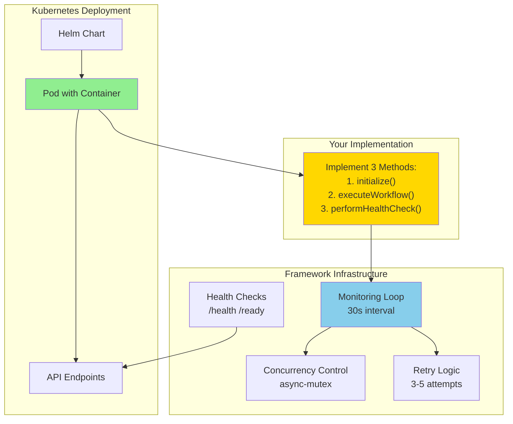
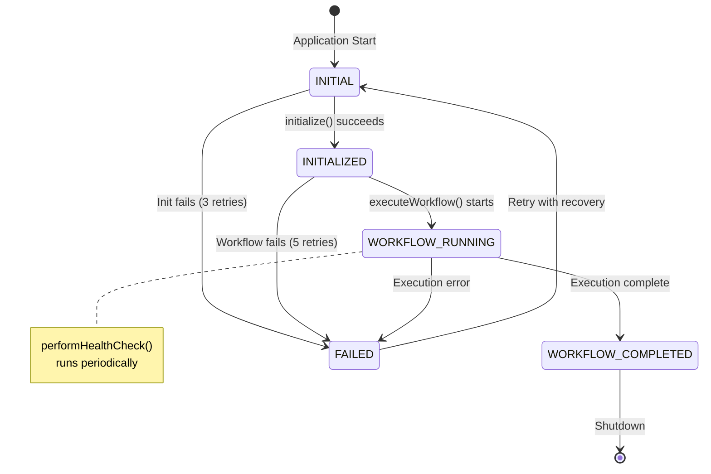

# Online Platform Automation

Kubernetes-based automation framework using TypeScript, Express, and Docker. Deploy scalable automation instances with individual configurations.

> **Note:** This is a framework/template. Implement your automation logic in the stage methods: `initialize()`, `executeWorkflow()`, and `performHealthCheck()`.

## Architecture Overview



## Features

- 🚀 **Kubernetes-Native**: Deploy with Helm charts
- 🐳 **Containerized**: Multi-stage Docker builds  
- 📊 **Multi-User**: Support multiple isolated instances
- 🔧 **Configurable**: Environment-based configuration
- 📝 **TypeScript**: Type-safe development
- 🏥 **Health Checks**: Built-in endpoints for K8s probes (liveness, readiness)
- 📦 **Minimal**: Optimized Alpine-based images
- 🔒 **Concurrency Control**: Mutex-protected execution preventing race conditions
- 🔄 **Retry Logic**: Configurable retry mechanisms per stage
- 🎯 **Stage Management**: Execution pipeline with state tracking
- ⏱️ **Automated Monitoring**: Self-healing with configurable health checks

## Quick Start

### Option 1: Kubernetes Deployment (Recommended)

```bash
# 1. Setup prerequisites (Docker, kubectl, Helm, K8s cluster)
# See K8S_SETUP.md for detailed instructions

# 2. Build and deploy all users
./automate.sh

# 3. Check deployment status
./automate.sh list

# 4. View logs
./automate.sh logs user1
```

See [KUBERNETES.md](KUBERNETES.md) for quick reference or [K8S_SETUP.md](K8S_SETUP.md) for comprehensive guide.

### Option 2: Local Development

```bash
# 1. Clone repository
git clone <your-repo-url>
cd online-platform-automation

# 2. Install dependencies
cd source && npm install

# 3. Run locally
npm run dev
```

For detailed deployment instructions, see [DEPLOYMENT.md](DEPLOYMENT.md).

## Project Structure

```
.
├── helm/platform-automation/    # Kubernetes deployment
│   ├── Chart.yaml              # Chart metadata
│   ├── values.yaml             # Default values
│   └── templates/
│       └── deployment.yaml     # K8s deployment spec
├── source/                     # Application code
│   ├── Dockerfile              # Container build
│   ├── package.json            # Dependencies
│   ├── tsconfig.json           # TS config
│   └── src/
│       ├── index.ts            # Main entry point
│       └── utils/
│           └── logger.ts       # Logging utility
├── user-configs/               # User configurations
│   └── user1.yaml              # Example config
└── package.json                # Deployment scripts
```

## Technical Architecture

## Implementing Your Automation

This framework provides production-ready infrastructure. Implement your logic in the stage methods:

### 1. Initialization Stage

```typescript
async initialize(): Promise<boolean> {
    try {
        Logger.info("Initializing automation system...");
        
        // TODO: Add your initialization logic
        // Examples:
        // - Connect to databases
        // - Initialize external clients (Puppeteer, APIs)
        // - Load configuration files
        // - Set up resources
        
        this.currentStage = ExecutionStage.INITIALIZED;
        return true;
    } catch (error: any) {
        Logger.error(`Initialization failed: ${error.message}`);
        return false;
    }
}
```

### 2. Workflow Execution (Mutex-Protected)

```typescript
async executeWorkflow(): Promise<boolean> {
    // Mutex automatically prevents concurrent execution
    try {
        Logger.info(`Starting workflow execution #${this.executionCount}...`);
        
        // TODO: Implement your automation workflow
        // Examples:
        // - Web scraping with Puppeteer
        // - API integrations
        // - Data processing pipelines
        // - Scheduled operations
        
        this.currentStage = ExecutionStage.WORKFLOW_COMPLETED;
        return true;
    } catch (error: any) {
        Logger.error(`Workflow failed: ${error.message}`);
        return false;
    }
}
```

### 3. Health Check Stage

```typescript
async performHealthCheck(): Promise<boolean> {
    try {
        // TODO: Add health check logic
        // Examples:
        // - Verify external service connections
        // - Check resource availability
        // - Validate data integrity
        
        return true;
    } catch (error: any) {
        Logger.error(`Health check failed: ${error.message}`);
        return false;
    }
}
```

### Architecture Benefits

- **Automated Monitoring**: Runs every 30 seconds checking system health
- **Mutex Protection**: Prevents race conditions in concurrent operations
- **Retry Logic**: Configurable retries per stage (3-5 attempts)
- **State Tracking**: ExecutionStage enum tracks workflow progress
- **Self-Healing**: Automatic recovery from degraded states

### Execution Stage Flow



## API Endpoints

## API Endpoints

### GET /status

Returns detailed service status with stage information and retry counts.

### GET /health

Basic health check for Kubernetes liveness probe.

### GET /ready

Readiness probe - returns HTTP 200 if system is ready, 503 if failed.

For detailed API documentation, see [TECHNICAL_DOCUMENTATION.md](TECHNICAL_DOCUMENTATION.md).

## Documentation

- **[README.md](README.md)** - This file (project overview)
- **[KUBERNETES.md](KUBERNETES.md)** - Quick reference for K8s deployment
- **[K8S_SETUP.md](K8S_SETUP.md)** - Comprehensive Kubernetes setup guide
- **[DEPLOYMENT.md](DEPLOYMENT.md)** - General deployment guide
- **[TECHNICAL_DOCUMENTATION.md](TECHNICAL_DOCUMENTATION.md)** - Detailed architecture and system design

## Kubernetes Deployment Files

- **[automate.sh](automate.sh)** - Main automation script for building and deploying
- **[Makefile](Makefile)** - Alternative make-based deployment commands
- **[helm/platform-automation/](helm/platform-automation/)** - Helm chart for Kubernetes
- **[user-configs/](user-configs/)** - User-specific configuration files
