# Online Platform Automation

Kubernetes-based automation framework using TypeScript, Express, and Docker. Deploy scalable automation instances with individual configurations.

> **Note:** This is a framework/template. Implement your automation logic in the `Automation.run()` method in `source/src/index.ts`.

## Architecture Overview


## Features

- 🚀 **Kubernetes-Native**: Deploy with Helm charts
- 🐳 **Containerized**: Multi-stage Docker builds
- 📊 **Multi-User**: Support multiple isolated instances
- 🔧 **Configurable**: Environment-based configuration
- 📝 **TypeScript**: Type-safe development
- 🏥 **Health Checks**: Built-in endpoints for K8s probes (liveness, readiness)
- 📦 **Minimal**: Optimized Alpine-based images
- 🔒 **Concurrency Control**: Mutex-protected execution preventing race conditions
- 🔄 **Retry Logic**: Configurable retry mechanisms with exponential backoff
- 📈 **Prometheus Metrics**: Built-in metrics endpoint for monitoring
- 🎯 **Stage Management**: Execution pipeline with state tracking
- ⏱️ **Automated Monitoring**: Self-healing with configurable health checks

## Prerequisites

- **Docker**: v20.x or later
- **Kubernetes**: v1.24+ (Minikube, Docker Desktop, k3s, or cloud)
- **Helm**: v3.x or later
- **Node.js**: v18.0.0+ (for local development)
- **kubectl**: Configured for your cluster

## Quick Start

### Deployment Workflow

```mermaid
flowchart LR
    A[1. Clone Repo] --> B[2. Build Docker Image]
    B --> C[3. Configure User YAML]
    C --> D[4. Deploy with Helm]
    D --> E[5. Verify Deployment]
    
    E --> F{All Checks Pass?}
    F -->|Yes| G[✓ Deployment Success]
    F -->|No| H[Check Logs & Debug]
    H --> C
    
    style A fill:#e1f5ff
    style B fill:#ffe1f5
    style C fill:#f5ffe1
    style D fill:#fff5e1
    style E fill:#f5e1ff
    style G fill:#90EE90
    style H fill:#FFB6C6
```



### 1. Clone and Setup

```bash
git clone <your-repo-url>
cd online-platform-automation
```

### 2. Build Docker Image

```bash
npm run docker:build
# Or manually:
docker build -t online-platform-automation:dev source
```

### 3. Configure User

Create or edit `user-configs/user1.yaml`:

```yaml
userConfig:
  username: "your_username"
  password: "your_password"
  homeUrl: "https://platform.example.com"
  emailPrefix: "you@example.com"
  targetUrl: "https://platform.example.com/target"
  logLevel: "info"
  headless: 1
```

### 4. Deploy to Kubernetes

```bash
helm install user1 helm/platform-automation -f user-configs/user1.yaml
```

### 5. Verify Deployment

```bash
kubectl get pods
kubectl logs -f -l app=user1
```

## Project Structure

```
.
├── helm/platform-automation/    # Kubernetes deployment
│   ├── Chart.yaml              # Chart metadata
│   ├── values.yaml             # Default values
│   └── templates/
│       └── deployment.yaml     # K8s deployment spec
├── source/                     # Application code
│   ├── Dockerfile              # Container build
│   ├── package.json            # Dependencies
│   ├── tsconfig.json           # TS config
│   └── src/
│       ├── index.ts            # Main entry point
│       └── utils/
│           └── logger.ts       # Logging utility
├── user-configs/               # User configurations
│   └── user1.yaml              # Example config
└── package.json                # Deployment scripts
```

## Configuration

### Helm Values (values.yaml)

```yaml
replicaCount: 1

image:
  repository: online-platform-automation
  pullPolicy: IfNotPresent
  tag: "dev"

userConfig:
  username: ""
  password: ""
  homeUrl: ""
  emailPrefix: ""
  targetUrl: ""
  logLevel: "info"
  headless: 1

resources:
  limits:
    cpu: 500m
    memory: 512Mi
  requests:
    cpu: 100m
    memory: 256Mi
```

### Environment Variables

- `USERNAME`: Platform username
- `PASSWORD`: Platform password
- `HOME_URL`: Platform base URL
- `EMAIL_PREFIX`: Email configuration
- `TARGET_URL`: Target resource/session URL
- `LOG_LEVEL`: Logging level (`debug`, `info`, `warn`, `error`)
- `HEADLESS`: Browser mode (1 = headless, 0 = visible)
- `PORT`: Server port (default: 3000)

## Deployment

### Single User

```bash
helm install user1 helm/platform-automation -f user-configs/user1.yaml
```

### Multiple Users

```bash
helm install user1 helm/platform-automation -f user-configs/user1.yaml
helm install user2 helm/platform-automation -f user-configs/user2.yaml
helm install user3 helm/platform-automation -f user-configs/user3.yaml
```

### Update Deployment

```bash
helm upgrade user1 helm/platform-automation -f user-configs/user1.yaml
```

### Remove Deployment

```bash
helm uninstall user1
```

## Development

### Local Development

```bash
cd source
npm install
npm run dev          # Run with ts-node
npm run build        # Compile TypeScript
npm start            # Run compiled JS
```

### Environment Variables

Create `source/.env` for local development:

```bash
USERNAME=your_username
PASSWORD=your_password
HOME_URL=https://platform.example.com
EMAIL_PREFIX=you@example.com
TARGET_URL=https://platform.example.com/target
LOG_LEVEL=debug
HEADLESS=1
PORT=3000
```

**⚠️ Never commit `.env` files!**

## Implementing Your Automation

This framework provides production-ready infrastructure. Implement your logic in the stage methods:

### 1. Initialization Stage

```typescript
async initialize(): Promise<boolean> {
    try {
        Logger.info("Initializing automation system...");
        
        // TODO: Add your initialization logic
        // Examples:
        // - Connect to databases
        // - Initialize external clients (Puppeteer, APIs)
        // - Load configuration files
        // - Set up resources
        
        this.currentStage = ExecutionStage.INITIALIZED;
        return true;
    } catch (error: any) {
        Logger.error(`Initialization failed: ${error.message}`);
        return false;
    }
}
```

### 2. Workflow Execution (Mutex-Protected)

```typescript
async executeWorkflow(): Promise<boolean> {
    // Mutex automatically prevents concurrent execution
    try {
        Logger.info(`Starting workflow execution #${this.executionCount}...`);
        
        // TODO: Implement your automation workflow
        // Examples:
        // - Web scraping with Puppeteer
        // - API integrations
        // - Data processing pipelines
        // - Scheduled operations
        
        this.currentStage = ExecutionStage.WORKFLOW_COMPLETED;
        return true;
    } catch (error: any) {
        Logger.error(`Workflow failed: ${error.message}`);
        return false;
    }
}
```

### 3. Health Check Stage

```typescript
async performHealthCheck(): Promise<boolean> {
    try {
        // TODO: Add health check logic
        // Examples:
        // - Verify external service connections
        // - Check resource availability
        // - Validate data integrity
        
        return true;
    } catch (error: any) {
        Logger.error(`Health check failed: ${error.message}`);
        return false;
    }
}
```

### Architecture Benefits

- **Automated Monitoring**: Runs every 30 seconds checking system health
- **Mutex Protection**: Prevents race conditions in concurrent operations
- **Retry Logic**: Configurable retries per stage (3-5 attempts)
- **State Tracking**: ExecutionStage enum tracks workflow progress
- **Self-Healing**: Automatic recovery from degraded states

### Execution Stage Flow


### Adding Dependencies

Edit `source/package.json`:
```json
{
  "dependencies": {
    "dotenv": "^16.4.7",
    "express": "^4.21.2",
    "your-package": "^x.x.x"
  }
}
```

Then rebuild:
```bash
npm run docker:build
```

## Common Commands

### Docker

```bash
# Build image
npm run docker:build

# Remove image
docker image rm online-platform-automation:dev

# Full rebuild and deploy
npm run auto
```

### Helm

```bash
# Install
helm install <name> helm/platform-automation -f user-configs/<user>.yaml

# Upgrade
helm upgrade <name> helm/platform-automation -f user-configs/<user>.yaml

# Uninstall
helm uninstall <name>

# List deployments
helm list

# Get values
helm get values <name>

# Dry-run (validate before deploy)
helm install <name> helm/platform-automation -f user-configs/<user>.yaml --dry-run --debug
```

### Kubernetes

```bash
# View pods
kubectl get pods

# View logs
kubectl logs -l app=<release-name> -f

# Describe pod
kubectl describe pod <pod-name>

# Execute into container
kubectl exec -it <pod-name> -- sh

# Delete pod (will be recreated)
kubectl delete pod <pod-name>

# Scale deployment
kubectl scale deployment <release-name> --replicas=2
```

## API Endpoints

### GET /status

Returns detailed service status with stage information:

```json
{
    "username": "user1",
    "status": "healthy",
    "timestamp": "2025-12-03T14:00:00.000Z",
    "startTime": "2025-12-03T13:00:00.000Z",
    "currentStage": "workflow_completed",
    "executionCount": 42,
    "stageStatus": {
        "initialization": {
            "maxRetries": 3,
            "currentRetries": 0,
            "lastAttempt": "2025-12-03T13:00:01.000Z",
            "lastError": null,
            "success": true,
            "lastSuccessTime": "2025-12-03T13:00:01.500Z"
        },
        "workflowExecution": {
            "maxRetries": 5,
            "currentRetries": 0,
            "success": true,
            "lastSuccessTime": "2025-12-03T13:05:23.000Z"
        }
    },
    "message": "Automation service running"
}
```

### GET /health

Basic health check for Kubernetes liveness probe:

```json
{
    "status": "ok",
    "timestamp": "2025-12-03T14:00:00.000Z"
}
```

### GET /ready

Readiness probe with detailed status:

```json
{
    "ready": true,
    "status": "healthy",
    "currentStage": "workflow_completed",
    "timestamp": "2025-12-03T14:00:00.000Z"
}
```

### GET /metrics

Prometheus-compatible metrics for monitoring:

```
automation_uptime_seconds 3600
automation_execution_count 42
automation_status 2
automation_stage_success{stage="initialization"} 1
automation_stage_success{stage="workflowExecution"} 1
automation_stage_retries{stage="initialization"} 0
automation_stage_retries{stage="workflowExecution"} 0
```

## Troubleshooting

### Pod Not Starting

```bash
kubectl describe pod <pod-name>
kubectl logs <pod-name>
```

**Common causes:**
- Image not found: Rebuild image or check image name
- ImagePullBackOff: Set `pullPolicy: IfNotPresent` or `Never`
- CrashLoopBackOff: Check application logs

### Image Pull Errors

For local images with Minikube:
```bash
minikube image load online-platform-automation:dev
```

For Docker Desktop: Ensure image exists
```bash
docker images | grep online-platform-automation
```

### Configuration Issues

```bash
# Validate Helm chart
helm lint helm/platform-automation

# Preview rendered templates
helm template test helm/platform-automation -f user-configs/user1.yaml
```

### Resource Constraints

If pods are evicted or OOMKilled:

```yaml
resources:
  limits:
    cpu: 1000m
    memory: 1Gi
  requests:
    cpu: 200m
    memory: 512Mi
```

### View Resource Usage

```bash
kubectl top pods
kubectl top nodes
```

## Managing Multiple Users

### Batch Deployment Script

Create `deploy-all.sh`:

```bash
#!/bin/bash
for config in user-configs/*.yaml; do
  username=$(basename "$config" .yaml)
  echo "Deploying $username..."
  helm install "$username" helm/platform-automation -f "$config"
done
```

Run:
```bash
chmod +x deploy-all.sh
./deploy-all.sh
```

### List All Instances

```bash
helm list
kubectl get pods -o wide
```

## Documentation

- **[Technical Documentation](TECHNICAL_DOCUMENTATION.md)** - Detailed architecture, APIs, and system design
- **[README](README.md)** - This file (quick start and usage)

## Security Best Practices

- Never commit `.env` files or secrets
- Use Kubernetes Secrets for sensitive data
- Set resource limits to prevent resource hogging
- Use network policies for pod isolation
- Implement RBAC for namespace-scoped access
- Regularly update dependencies

## Contributing

1. Fork the repository
2. Create a feature branch
3. Implement your changes
4. Test thoroughly
5. Submit a pull request

## License

MIT License - See LICENSE file for details

## Support

For issues or questions:
- Check [Technical Documentation](TECHNICAL_DOCUMENTATION.md)
- Review troubleshooting section above
- Open an issue on GitHub

---

Made with ❤️ for the Kubernetes community
